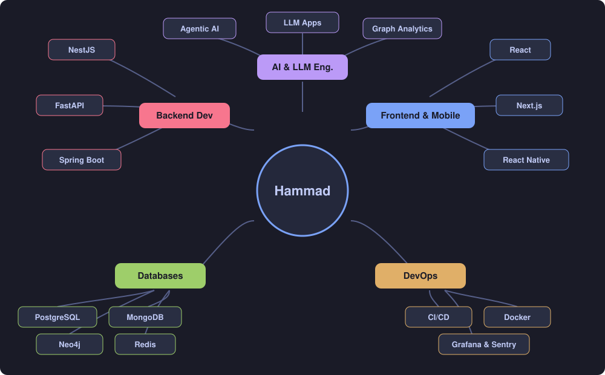

# Hi 👋 I'm Muhammad Hammad

### 💻 Backend & Full-Stack Developer • AI Enthusiast

Building scalable backend systems, full-stack applications, and AI-powered products.

---

# 👨‍💻 About Me

🚀 Backend & Full-Stack Developer focused on building scalable applications and intelligent systems.

I enjoy working on backend architecture, APIs, databases, distributed systems, and AI-powered applications.

Currently exploring:

* ⚡ Backend Engineering
* 🏗️ System Design
* 🌐 Distributed Systems
* 🤖 AI & LLM Applications
* 🔗 Graph Databases
* ☁️ Cloud Computing
* 🧩 Microservices

---

# 🛠 Tech Stack

## Languages

## Frontend

## Mobile

## Backend

## Databases

* Neo4j
* Firebase Firestore

## AI / ML

* TensorFlow
* PyTorch
* OpenCV
* YOLO
* Scikit-Learn
* Pandas
* NumPy

## DevOps & Tools

Also worked with:

* GraphQL
* REST APIs
* Socket.IO
* Cloudinary
* JWT
* Passport.js
* OpenTelemetry
* Sentry
* Grafana Cloud
* PM2

---

# 🗺️ Skill Map

---

# 🚀 Featured Projects

## 🌾 KisanNama

An autonomous multi-agent AI platform designed to help Pakistani farmers avoid crop oversupply and financial losses.

### Multi-Agent Architecture

* Data Agent
* Risk Agent
* Market Agent
* Strategy Agent
* Alert Agent

### Features

* District-level crop trend analysis
* Price crash prediction
* Market demand forecasting
* Urdu AI recommendations
* Weather-aware crop planning

**Tech**

Agentic AI • FastAPI • LLMs • Python • Graph Analytics

---

## 📞 WhatsApp AI Voice & Calling Agent

An AI-powered communication platform that enables users to interact with an intelligent voice agent through WhatsApp and phone calls.

### Features

* 🎙️ AI-powered WhatsApp voice interactions
* 📞 Real-time AI phone calls
* 🧠 Natural language conversations powered by OpenAI
* 🔊 Speech-to-Text and Text-to-Speech
* 💬 Context-aware conversational responses
* ⚡ Real-time voice agent interactions
* 🔗 WhatsApp integration
* 🌐 Webhook-based event processing
* 📡 Voice calling integration
* 🔐 Secure API and webhook handling

**Tech**

Next.js • TypeScript • OpenAI SDK • Ultravox Voice Agents • WhatsApp API • Webhooks • AI/LLMs

## ⚡ Unison

A professional alumni networking platform designed to connect graduates, students, and alumni through social and professional features.

### Features

* JWT Authentication
* MongoDB + Neo4j
* GraphQL APIs
* REST APIs
* Socket.IO
* Email Service
* Cloudinary
* Swagger
* OpenTelemetry
* Grafana Cloud
* Sentry Monitoring

**Tech**

NestJS • MongoDB • Neo4j • TypeScript • Docker

---

## 🛒 E-Commerce Platform

A complete clothing e-commerce platform featuring:

* Admin Dashboard
* Authentication
* Shopping Cart
* Orders
* Product Management

**Tech**

React • Node.js • Express.js • MongoDB

---

## 🌐 WebRTC Peer-to-Peer Platform

A real-time peer-to-peer communication platform featuring:

* Video Calls
* File Sharing
* Peer Discovery

**Tech**

WebRTC • JavaScript • Node.js

---

## 🤖 Machine Failure Prediction System

Machine learning project focused on predictive maintenance.

### Features

* Failure prediction
* Data preprocessing
* Feature engineering
* Model evaluation

**Tech**

Python • Scikit-Learn • Pandas

---

## 🩺 Skin Cancer Detection

Deep learning project for skin lesion detection and classification.

### Features

* Skin lesion detection
* Object detection
* Medical image analysis

**Tech**

YOLO • OpenCV • Python

---

# 🌱 Currently Learning

* Java & Spring Boot
* Advanced System Design
* Distributed Systems
* Microservices
* Kubernetes
* AWS
* LLM Applications
* AI Infrastructure & MLOps

---

# 📊 GitHub Stats

---

# 📈 Contribution Graph

---

# 🎯 2026 Goals

* 🚀 Build production-ready backend & AI systems
* 🌍 Contribute to Open Source
* ☁️ Gain hands-on experience with AWS & Kubernetes
* 🏗️ Improve distributed systems and system design skills
* 🤖 Build and deploy production AI applications
* 📖 Publish technical and research work

---

# 📫 Connect With Me

---

# 💭 Quote I Like

> "The best way to predict the future is to build it."

---

### ⭐ Thanks for visiting my profile!

Always learning • Always building • Always improving

